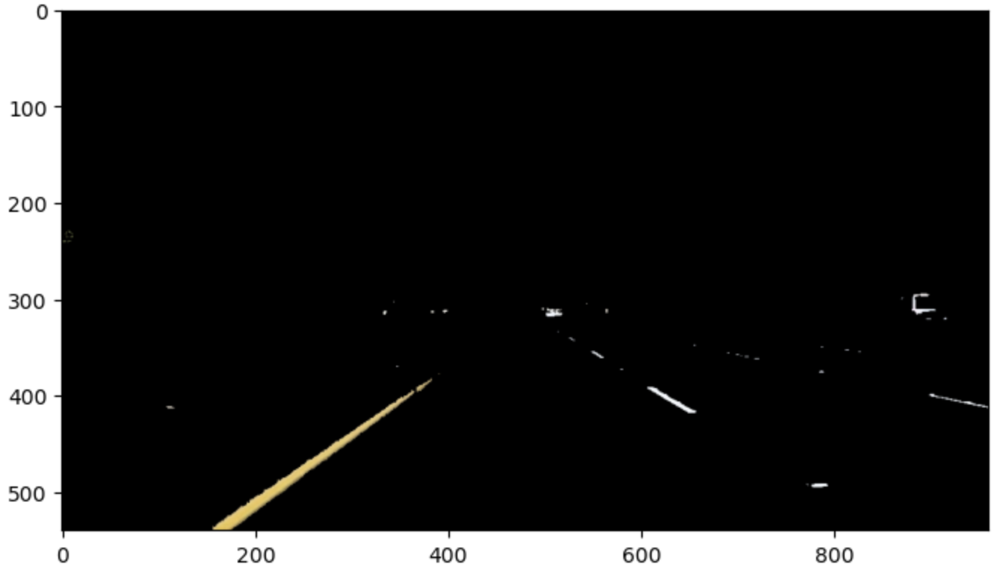
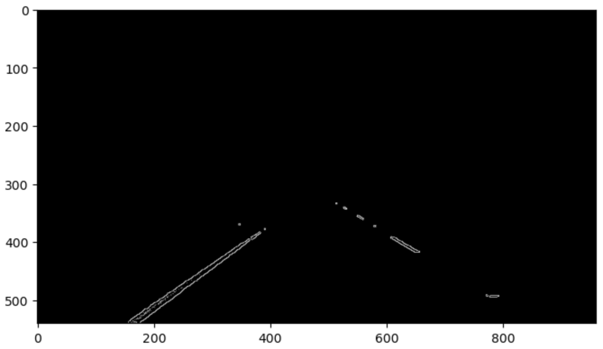
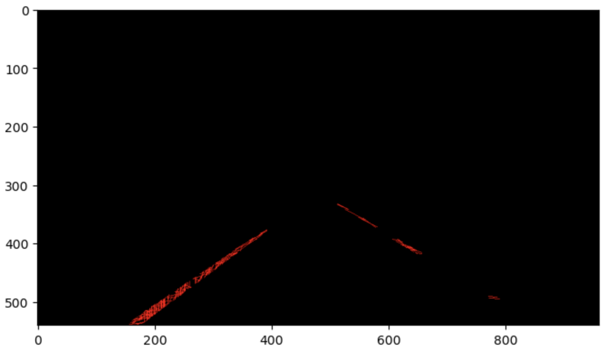
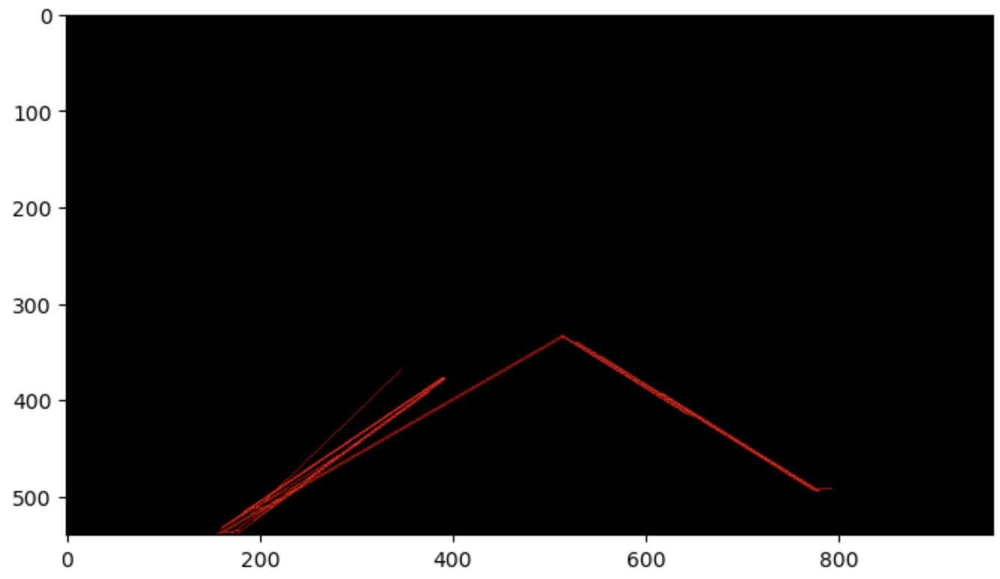

# **Finding Lane Lines on the Road** 

## Writeup Template

### You can use this file as a template for your writeup if you want to submit it as a markdown file. But feel free to use some other method and submit a pdf if you prefer.

---

**Finding Lane Lines on the Road**

The goals / steps of this project are the following:
* Make a pipeline that finds lane lines on the road
* Reflect on your work in a written report

[//]: # (Image References)

---

### Reflection

### 1. Describe your pipeline. As part of the description, explain how you modified the draw_lines() function.

My pipeline consisted of the following main steps:

1. Colour thresholding:
- In this step, we filter out all colours in the input image except for yellow and white, which are the standard lane marking colours. 
- We take the input image (in RGB format) and convert it to HSV. We then make use of HSV to define a range for yellow and white colours, using these to create seperate binary masks for yellow and white, then combining these masks using `bitwise_or` to create a single binary mask.
- We use thresholding to set all pixels that are not yellow or white to 0. This is implemented using `bitwise and`, which applies the mask to our original image.
<figure>
    
    <figcaption>Result of our colour thresholding. You can see the yellow and white lane pixels.</figcaption>
</figure>

2. Conversion to grayscale:
- We convert the output image of the colour thresholding step and produce a grayscale image using OpenCV functions.

3. Smoothing
- We apply Gaussian smoothing on the grayscale image.
- A small kernel size of 3x3 is used, since the `canny` function in OpenCV already applies some noise reduction under the hood.

4. Canny edge detector
- The OpenCV `canny` function is called on the smoothed image, providing us with thin edges that we can later use for determinign the hough lines.
<figure>
    
    <figcaption>Our Canny output.</figcaption>
</figure>

5. Region of interest selection
- The image still contains edges that do not correspond to lane markings and are thus outside our region of interest.
- We set such pixels to be black using the provided `region_of_interest` function.
- The RoI vertices were determined approximately based on the test_images.

6. Line segment detection
- We use a probabilistic Hough detector to detect line segments from the thin edges in our RoI.
- This is appropriate because some lane markings are dashed lines, so we can detect line segemnts corresponding to each of the dashes in the image.
- A relatively low `threshold` was used to ensure that we captures the shorter segments corresponding to dashed lane markings; in fact, sometimes if the threshold was too high, it failed to detect any edges on the left or right side of the image. At the same time, I did not want the threshold to be too low, otherwise we have too many very short line segments.
<figure>
    
    <figcaption>Hough threshold too low - our "thin" edges no longer look like "thin" edges! Too many tiny line segments overcrowding it.</figcaption>
</figure>

- I also made sure `maxLineGap` was not too high. Otherwise, the Hough detector would try to detect lines between points that were quite far apart; sometimes these far-apart points would indeed be on the same lane line, but oftentimes they were spurious edges.

<figure>
    
    <figcaption>maxLineGap too large</figcaption>
</figure>

7. Line segment classification
- In this step, we divide the Hough line segments into two categories: `left_segments` and `right_segments`. 
- The segments whose points are to the left of the middle x coordinate of the image are put into as `left_segments`, and the complement of that set comprises the other category `right_segments`.

8. Line fitting
- In this step, we fit lines for the left and right lane markings.
- We use RANSAC because it is a rather robust approach when it comes to dealing with outliers.
- We convert the left and right segments to points, and separately fit a line to each set of points using `RANSACRegressor()`, obtaining the slope and y intercept of these lines.
- Using the slope and intercept, we can compute the start and endpoint of the proposed left and right lane in the image.

Note that the `draw_lines()` function itself was not modified. But it was still effectively modified because we passed just just one line to the function to draw each road lane, as we had already computed a complete lane line from the individual Hough segments.

### 2. Identify potential shortcomings with your current pipeline

One potential shortcoming would be what would happen when we get image data from a different perspective. In that case, the RoI could be different, so the fixed RoI shape we defined in the pipelines would not be accurate.

Another shortcoming would be what would happen if the pavement markings have a faded colour or low contrast with the road due to unfavourable lighting. This could lead to low gradient values for the edge points, impacting our ability to detect the edges.

Another possible shortcoming would be that it does not accurately deal with curved lanes (such as a ramp).

### 3. Suggest possible improvements to your pipeline

A possible improvement would be to dynamically determine the RoI rather than hardcoding one based on the test images. To do so, we could first use Hough detector with a higher threshold to determine the lines with the most votes, as those would most likely belong to our RoI; the rest would most likely be outside our RoI.

Another potential improvement could be to convert the image to binary instead of grayscale. That way, lane markings with a less white colour (e.g. yellow lanes or lanes with faded colour) could be rounded up to "white" pixel values, ensuring we have high enough contrast that we do not miss detecting the relvant edges.
